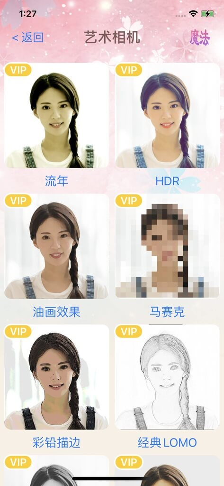

# 魔法相机

**中文版** | [English Version](Readme_EN.md)

**Github LFS 有流量限制，请从网盘下载预训练模型文件**

## 教程

相关开放教程会持续更新，请关注 [魔法相机中文教程](https://www.jianshu.com/nb/51502363) 

## 简介

魔法相机是一款基于SwiftUI和CoreML开发的 iOS AI 相机应用，实现了下列功能：

 - 人像卡通化，可以让你的照片变成卡通头像
 - 人像风格迁移，可以让你的照片变老、变年轻、变发色等
 - 美颜相机，支持磨皮、瘦脸和各种滤镜效果
 - 艺术效果，让你的照片别成各种艺术风格
<p align="center">
    
    
    
</p>

##  AI模型

各种AI特效都基于苹果的CoreML开发，不需要访问网络，iOS13 以上设备都可以使用。

### 一、下载模型


从网盘下载预训练模型，并将其解压到 ```MagicCamera/Vision/models``` 目录下

从 [百度网盘链接](https://pan.baidu.com/s/1DvKXY2XwTYvZhsGEWx6iXw) 下载，提取码: **vib8**

从 [Google Drive](https://drive.google.com/file/d/1T644NT5GnzBlKgQnxL6eEMcTqZShs7dK/view?usp=sharing) 下载


### 二、模型源码

#### 人像卡通化

- photo2cartoon模型转换为CoreML模型文件。项目地址：
[https://github.com/william0wang/photo2cartoon](https://github.com/william0wang/photo2cartoon)

- AnimeGANv2模型转换为CoreML模型文件。项目地址：
[https://github.com/william0wang/CoreML-Models](https://github.com/william0wang/CoreML-Models)

#### 人像风格迁移

- 风格迁移AttGAN-PyTorch模型转换为CoreML模型文件。项目地址：
[https://github.com/william0wang/AttGAN-PyTorch](https://github.com/william0wang/AttGAN-PyTorch)

#### 艺术效果

- 艺术效果fast-neural-style模型转换为CoreML模型文件。项目地址：
[https://github.com/william0wang/fast-neural-style](https://github.com/william0wang/fast-neural-style)

## 后续计划

首先，计划未来一段时间，把开发过程中的心得和各种技术细节通过文章分享给大家，希望对大家能用帮助。

在功能方面，当前已经实现了AI相机App最流行的拍照功能。后续计划会增加更多视频相关功能，入视频变脸等。
